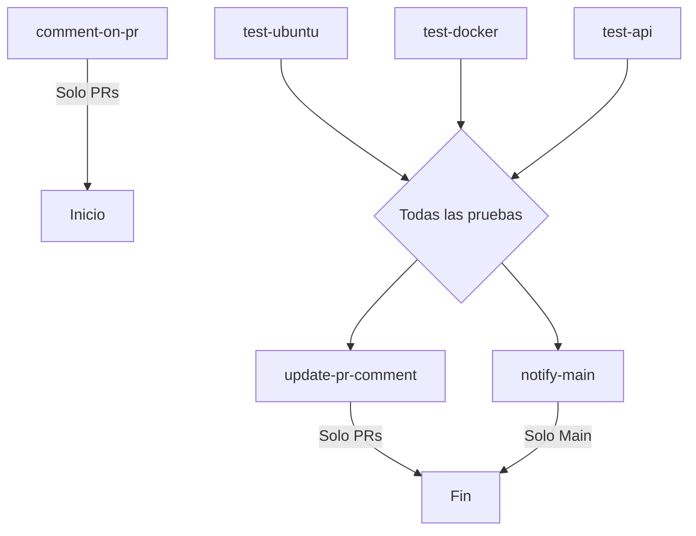

# 🚀 CI/CD Pipeline - Sistema de Diagnóstico Médico

## Descripción

Pipeline completo de CI/CD configurado con GitHub Actions que automatiza las pruebas y el despliegue del sistema de diagnóstico médico profesional.

## 📋 Eventos que Activan el Pipeline

### 1. Pull Requests hacia Main
- **Trigger**: Cada vez que se abre, actualiza o reabre un PR hacia `main`
- **Acciones**:
  - Comenta automáticamente en el PR: "CI/CD en acción. Ejecutando tareas..."
  - Ejecuta todas las pruebas
  - Actualiza el comentario con los resultados

### 2. Commits en Main
- **Trigger**: Cada push/commit directamente a la rama `main`
- **Acciones**:
  - Ejecuta todas las pruebas
  - Notifica el éxito del commit

## 🧪 Jobs del Pipeline

### Job 1: Comentar en PR (comment-on-pr)
- **Cuándo**: Solo en Pull Requests
- **Acción**: Crea un comentario inicial indicando que las pruebas están en progreso

### Job 2: Pruebas Unitarias en Ubuntu (test-ubuntu)
- **Entorno**: Ubuntu latest
- **Acciones**:
  1. Checkout del código
  2. Configuración de Python 3.11
  3. Instalación de dependencias (`requirements.txt`)
  4. Ejecución de 10 pruebas unitarias con `test_diagnostico.py`
  5. Generación de reporte de cobertura
  6. Upload del reporte como artefacto

**Pruebas Incluidas**:
- ✅ Test 1: Paciente saludable (NO ENFERMO)
- ✅ Test 2: Paciente con condición leve (ENFERMO LEVE)
- ✅ Test 3: Paciente con condición aguda (ENFERMO AGUDO)
- ✅ Test 4: Paciente con condición crónica (ENFERMO CRONICO)
- ✅ Test 5: Paciente en estado crítico (ENFERMEDAD TERMINAL)
- ✅ Test 6: Valores límite NO ENFERMO
- ✅ Test 7: Valores límite entre categorías
- ✅ Test 8: Múltiples casos normales
- ✅ Test 9: Comparación paciente joven vs mayor
- ✅ Test 10: Impacto de oxigenación crítica

### Job 3: Pruebas en Docker (test-docker)
- **Entorno**: Docker en Ubuntu
- **Acciones**:
  1. Construir imagen Docker del proyecto
  2. Ejecutar pruebas dentro del contenedor
  3. Verificar que la aplicación funcione (endpoint `/health`)

### Job 4: Pruebas de API REST (test-api)
- **Entorno**: Ubuntu latest
- **Acciones**:
  1. Iniciar la aplicación Flask
  2. Probar endpoint `/health`
  3. Probar endpoint `/api/predict` (POST)
  4. Probar endpoint `/api/estadisticas`

### Job 5: Análisis de Calidad de Código (code-quality)
- **Herramientas**:
  - `flake8`: Análisis de estilo
  - `black`: Verificación de formato
  - `pylint`: Análisis estático

### Job 6: Actualizar Comentario PR (update-pr-comment)
- **Cuándo**: Después de todas las pruebas, solo en PRs
- **Acción**: Actualiza el comentario inicial con:
  - Tabla de resultados de cada job
  - Estado general (✅ o ❌)
  - Enlaces a logs detallados

### Job 7: Notificación en Main (notify-main)
- **Cuándo**: Solo en commits a `main`
- **Acción**: Notifica el éxito de las pruebas en la consola

## 📊 Estructura del Archivo

```yaml
.github/workflows/ci-cd.yml
```

### Dependencias del Pipeline



## 🔧 Configuración Local

### Ejecutar Pruebas Localmente

```bash
# Instalar dependencias
pip install -r requirements.txt

# Ejecutar pruebas
python test_diagnostico.py

# Con pytest (opcional)
pytest test_diagnostico.py -v

# Con cobertura
pytest test_diagnostico.py --cov=Diagnostico --cov-report=html
```

### Construir y Probar Docker Localmente

```bash
# Construir imagen
docker build -t diagnostico-app:test .

# Ejecutar pruebas en Docker
docker run --rm diagnostico-app:test python test_diagnostico.py

# Verificar aplicación
docker run -d -p 5000:5000 diagnostico-app:test
curl http://localhost:5000/health
```

## 📝 Ejemplo de Comentario en PR

Cuando el pipeline se ejecuta en un PR, genera automáticamente un comentario como este:

```markdown
## ✅ CI/CD - Resultados

**Todas las pruebas pasaron exitosamente**

### 📊 Resumen de Pruebas

| Tarea | Estado | Resultado |
|-------|--------|-----------|
| Pruebas Ubuntu | ✅ | success |
| Pruebas Docker | ✅ | success |
| Pruebas API | ✅ | success |

### 📝 Detalles

- **Pruebas Unitarias**: 10 tests del modelo de diagnóstico médico
- **Construcción Docker**: Imagen construida y verificada
- **API REST**: Endpoints probados y funcionales
- **Estadísticas**: Sistema de persistencia verificado

### 🔗 Enlaces

- [Ver workflow completo](link_al_workflow)
- [Ver logs detallados](link_a_logs)

---

_Pipeline ejecutado: 2025-11-14T07:30:00.000Z_
```

## 🔐 Permisos Requeridos

El pipeline utiliza `GITHUB_TOKEN` que se proporciona automáticamente con los siguientes permisos:
- `contents: read` - Para checkout del código
- `issues: write` - Para comentar en PRs
- `pull-requests: write` - Para actualizar PRs

## 🚨 Manejo de Errores

- Si cualquier prueba falla, el job marca como fallido
- Los comentarios en PRs se actualizan con el estado de fallo
- Los artefactos se suben incluso si hay fallos (para debugging)

## 📈 Métricas y Reportes

### Artefactos Generados

1. **coverage-report-ubuntu**: Reporte HTML de cobertura de código
   - Retención: 30 días
   - Accesible desde la página del workflow

### Información en Logs

- Salida detallada de cada prueba
- Tiempos de ejecución
- Mensajes de error específicos

## 🔄 Flujo Completo

### Para un Pull Request:

1. Desarrollador abre PR hacia `main`
2. GitHub Actions se activa automáticamente
3. Bot comenta: "CI/CD en acción..."
4. Se ejecutan 10 pruebas unitarias en Ubuntu
5. Se construye y prueba imagen Docker
6. Se prueban los endpoints de la API
7. Se analiza la calidad del código
8. Bot actualiza comentario con resultados detallados
9. Si todo pasa ✅, el PR puede ser merged
10. Si algo falla ❌, se muestran los errores

### Para un Commit en Main:

1. Código se mergea o se pushea directamente a `main`
2. GitHub Actions se activa automáticamente
3. Se ejecutan todas las pruebas
4. Se notifica el resultado en los logs
5. Si todo pasa ✅, el commit queda verificado

## 🎯 Mejores Prácticas Implementadas

- ✅ Separación de concerns (cada job tiene una responsabilidad)
- ✅ Uso de caché para dependencias (Python pip cache)
- ✅ Ejecución paralela de jobs independientes
- ✅ Feedback inmediato en PRs
- ✅ Artefactos para debugging
- ✅ Verificación en múltiples entornos (Ubuntu y Docker)
- ✅ Pruebas de integración de API
- ✅ Análisis de calidad de código

## 📚 Recursos Adicionales

- [GitHub Actions Documentation](https://docs.github.com/en/actions)
- [Pytest Documentation](https://docs.pytest.org/)
- [Docker Documentation](https://docs.docker.com/)

---

**Versión**: 1.0  
**Última actualización**: 14 de Noviembre de 2025  
**Mantenedor**: Sistema de Diagnóstico Médico v3.0
